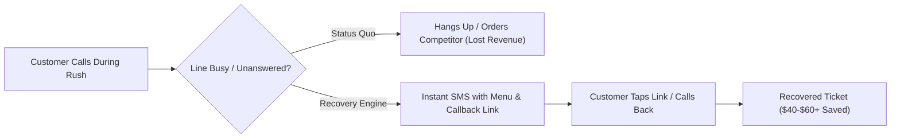

# PRD-001: Busy-Phone & Missed-Call Recovery Telephony Engine

**Author:** Continuity OS Software Factory  
**Status:** Approved for Implementation (2-Week Pilot Phase)  
**Target Market:** Greater Binghamton (607) & Regional Independent High-Volume Merchants  

---

## 1. Problem Statement

Independent, high-volume restaurants and emergency service contractors operate under severe phone bottlenecks during peak operational spikes (e.g., Friday/Saturday 5:00–7:30 PM dinner rush; bad-weather towing and plumbing calls).

When customers call during these surges:
1. Lines are engaged with busy signals or left ringing indefinitely while front-of-house staff attends to physical guests.
2. In competitive markets (pizza, takeout, emergency towing), **callers immediately hang up and call the next competitor on Google**.
3. High-ticket customers ($40–$60 average takeout ticket, $300–$1,500 emergency contractor ticket) are permanently lost, leaking hundreds to thousands of dollars in high-margin revenue per week.

---

## 2. Evidence & Grounding

- **Cortese Restaurant (Binghamton, NY)**: Historical staple where dinner rush phones ring continuously while counter staff packs orders. Colleen at Cortese confirmed peak rush phone overwhelm is the single biggest operational friction.
- **607 Regional Peer Group Data**:
  - **Brozzetti's Pizza**: Takeout-only model; lines perpetually busy between 5:00–7:00 PM.
  - **Nirchi's Pizza (Upper Front)**: Sheet-pizza dinner order spikes overwhelm single-line setups.
  - **Paul & Sons Pizza**: Artisanal high-demand pizzeria; calls go unanswered during dough prep.
  - **Joe's Garage & Towing**: Shop mechanics cannot drop tools to answer dispatch calls; abandoned calls go to competing auto shops.
- **Economic Value**:
  - Average takeout order value: $45.
  - Conservative recovery: 4 missed calls recovered per weekend night = 8 orders/week = **$360/week ($1,440/month) in recaptured top-line revenue**.

---

## 3. Falsifiable Hypothesis

> **If** an independent business automatically sends an instant SMS with a mobile-friendly menu link and tap-to-call button to callers who encounter a busy signal or ringout within 10 seconds of disconnect,  
> **Then** 15% to 25% of abandoned callers will complete their order through the recovery link or callback,  
> **Because** the customer's intent is urgent, and an immediate low-friction alternative removes the friction of waiting on hold or searching for another restaurant.

---

## 4. User Personas

| Persona | Role | Primary Need | Frustration |
|---|---|---|---|
| **Colleen / Floor Manager** | Restaurant Operator | Keep kitchen moving without phones ringing off the hook | Cannot hire a full-time phone operator just for a 2-hour Friday rush |
| **Hungry Customer** | End Caller | Place a takeout order quickly on Friday at 6 PM | Annoyed by busy tone; doesn't know where else to see the menu |
| **Operator / Account Exec** | Sales & Deployment | Demonstrate instant tangible ROI in under 60 seconds | Merchant skepticism towards complex tech; fear of staff disruption |

---

## 5. MVP Scope & Boundaries

### Included in MVP:
1. **Interactive Busy-Call Simulator**:
   - Zero-dependency web demo hosted on Vercel ([https://cortese-digital-xwbq.vercel.app](https://cortese-digital-xwbq.vercel.app)).
   - Parameterizable for any prospect (`?name=Brozzetti%27s&phone=6077979960&menu=...`).
   - Simulates simulated incoming call, busy tone, user pressing 1, and realistic SMS delivery.
2. **Telephony Engine & Compliance Seam**:
   - Provider-neutral telephony adapter (Twilio REST API + zero-cost simulated local adapter).
   - Mandatory AI spoken disclosure and recording notice on call connect.
   - Immediate Do-Not-Call (DNC) phrase suppression.
   - Comprehensive test suite (58 passing tests in `telemarketer-ai`).
3. **The Free 2-Week Pilot Framework**:
   - 14 calendar days of zero-cost call recovery.
   - 11 safety gates: no kitchen hardware modifications, no staff retraining, no credit card required upfront.
   - Operator setup in under 15 minutes via call-forwarding rules (`*71` conditional forward on busy).
4. **CRM & Audit Log in SQLite**:
   - Prospects stored as structured entities in `data/app.db`.
   - Event log recording all outreach activities and demo interactions.

### Explicit Non-Goals (Out of Scope for Pilot):
- ❌ No direct POS write-in integration (Toast/Square/Micros) during the initial 14-day trial.
- ❌ No autonomous credit card processing over AI voice.
- ❌ No replacing physical host or counter staff.

---

## 6. Success Metrics & Key Results

| Metric | Target | Measurement Method |
|---|---|---|
| **Demo Click-Through Rate** | >= 30% of emailed prospects | Analytics event on Vercel demo URL |
| **Pilot Conversion** | >= 1 signed 2-week pilot agreement | Signed pilot terms agreement |
| **Call Recovery Rate** | >= 15% of busy-hour calls recovered | Inbound SMS link clicks / completed callbacks |
| **Compliance Integrity** | 100% zero-tolerance adherence | DNC suppression verified before every outbound contact |

---

## 7. Operational Safety Gates (The 11 Commitments)

1. **Gate 1**: Zero financial commitment — completely free 14-day trial.
2. **Gate 2**: No credit card required at sign-up.
3. **Gate 3**: Zero hardware installation — works with existing landlines or VoIP.
4. **Gate 4**: Conditional forwarding only (`*71` on busy); normal calls ring through untouched.
5. **Gate 5**: Instant kill switch — operator can disable forwarding in 5 seconds.
6. **Gate 6**: Staff retains 100% control over kitchen order capacity.
7. **Gate 7**: TCPA compliance — automated disclosures on every automated touchpoint.
8. **Gate 8**: DNC phrase detection halts all further automated follow-up.
9. **Gate 9**: End-to-end audit logging in SQLite `events` table.
10. **Gate 10**: Transparent reporting delivered to owner every Sunday night.
11. **Gate 11**: Zero lock-in — merchant can walk away at day 14 with zero friction.
